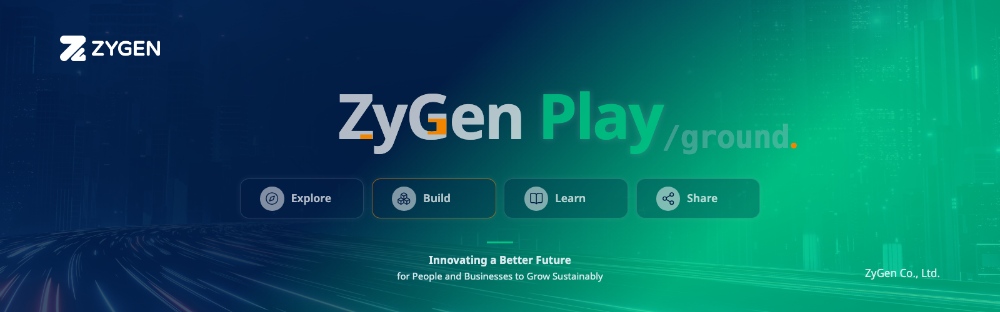

# ZyGen Play

  

**ZyGen Play** is a technology playground and knowledge space by **ZyGen Co., Ltd.**

> **Innovating a Better Future for People and Businesses to Grow Sustainably**

We explore technologies, build software, and share what we learn through engineering projects and documentation.

## What We Work On

- Software projects and technology experiments
- Shared libraries and reusable components
- Architecture, infrastructure, and automation
- Engineering guides and technical research

## Getting Started

Browse the available repositories and read each project’s README for its purpose, status, and setup instructions. Follow its contribution and support guidance when proposing changes or asking for help.

## Our Approach

Explore · Build · Learn · Share

- **Explore** — Discover ideas and new possibilities.
- **Build** — Experiment and innovate to create useful solutions.
- **Learn** — Develop skills and deepen engineering knowledge.
- **Share** — Document discoveries and make knowledge accessible.

We value practical engineering, thoughtful experimentation, and clear documentation. Each project follows its own review and validation process, including for AI-assisted contributions.
